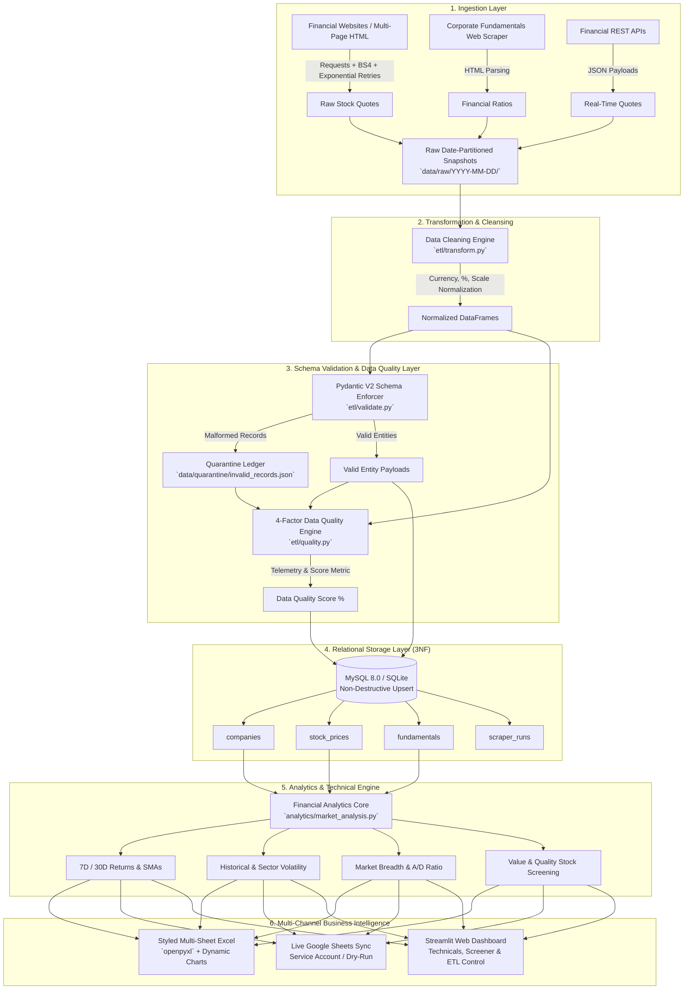

# 📈 Automated Market Data Scraper & Analytics Pipeline

[](https://github.com/shivenchauhan1/Automated-Market-Data-Scraper-Analytics-Pipeline/actions/workflows/tests.yml)
[](https://www.python.org/)
[-orange.svg)](https://www.mysql.com/)
[](https://www.docker.com/)
[](https://streamlit.io/)
[](LICENSE)

> **Enterprise-Grade Market Data Engineering & Financial Intelligence Platform.**  
> Ingests multi-page web quotes and REST API telemetry, performs normalization and Pydantic v2 schema governance, computes a deterministic **4-Factor Data Quality Score**, preserves historical time-series observations in a normalized 3NF relational database, computes technical indicators (7D/30D SMAs, returns, volatility, market breadth), and delivers multi-channel financial intelligence via styled Excel reports, Google Sheets, and an interactive Streamlit application.

---

## 🏗️ Architecture & Data Lifecycle



---

## ⚡ Core Engineering Highlights

- **Time-Series Historical Persistence**: Relational schema enforces a composite unique constraint `(company_id, price_date)` enabling non-destructive daily upserts that preserve historical price trajectories without overwriting past observations.
- **Deterministic Data Quality Framework**: Calculates a rigorous 4-factor Data Quality Score with automated schema quarantine taxonomy recording exact timestamp, source, raw record, field, and failure reason.
- **Financial Technical Analytics**: Computes 7-day and 30-day Simple Moving Averages (SMA), historical returns, standard deviation of return volatility, sector-level dispersion, and Advance/Decline breadth ratios.
- **Production Dual-Engine Storage**: Connects natively to **MySQL 8.0** with connection pooling and failover recovery, while maintaining zero-setup **SQLite** dev/test portability (`USE_SQLITE=true`).
- **Complete Dockerization & CI/CD**: Containerized with multi-container `docker-compose.yml` including persistent MySQL volumes and healthchecks, accompanied by automated GitHub Actions CI testing matrix across Python 3.10, 3.11, and 3.12.
- **Interactive BI Dashboard**: Streamlit interface with 6 tabs, Altair technical overlays (Price vs 7D/30D SMAs), company 360° inspection, value screener, live execution logs, and on-demand pipeline execution.

---

## 🛡️ Data Quality Framework & Scoring Formula

Data quality is quantified deterministically during every pipeline execution using a weighted 4-factor formula:

$$\text{Data Quality Score} = (0.40 \times S_{\text{valid}}) + (0.30 \times S_{\text{complete}}) + (0.20 \times S_{\text{unique}}) + (0.10 \times S_{\text{schema}})$$

| Metric Component | Weight | Mathematical Formulation | Description |
| :--- | :---: | :--- | :--- |
| **Validity ($S_{\text{valid}}$)** | **40%** | $\frac{N_{\text{valid}}}{N_{\text{valid}} + N_{\text{quarantined}}} \times 100$ | Percentage of records passing strict Pydantic v2 domain rules. |
| **Completeness ($S_{\text{complete}}$)** | **30%** | $\left(1 - \frac{\text{Null Cells}}{\text{Total Expected Cells}}\right) \times 100$ | Proportion of non-null required financial fields. |
| **Uniqueness ($S_{\text{unique}}$)** | **20%** | $\left(1 - \frac{\text{Duplicates}}{\text{Total Extracted}}\right) \times 100$ | Absence of duplicate ticker/timestamp pairs. |
| **Schema Conformance ($S_{\text{schema}}$)** | **10%** | $\max\left(0, 100 - (\text{Fatal Errors} \times 5)\right)$ | Type-safety and schema structural compliance. |

### Quarantined Records Ledger (`data/quarantine/invalid_records.json`)
When an invalid record is identified, it is isolated into quarantine with structured metadata:
```json
[
  {
    "timestamp": "2026-09-13T18:28:25.120450",
    "source": "market_prices",
    "record": { "symbol": "BAD_TICKER", "price": -99.0, "volume": -5 },
    "validation_error": "Input should be greater than or equal to 0",
    "field": "close_price",
    "error_type": "validation_error",
    "row_index": 1
  }
]
```

---

## 🗄️ Relational Database Schema (3NF)

```sql
CREATE TABLE companies (
    company_id INT AUTO_INCREMENT PRIMARY KEY,
    symbol VARCHAR(20) UNIQUE NOT NULL,
    company_name VARCHAR(150) NOT NULL,
    sector VARCHAR(100),
    industry VARCHAR(100)
);

CREATE TABLE stock_prices (
    price_id BIGINT AUTO_INCREMENT PRIMARY KEY,
    company_id INT NOT NULL,
    price_date DATE NOT NULL,
    open_price DECIMAL(15,2),
    high_price DECIMAL(15,2),
    low_price DECIMAL(15,2),
    close_price DECIMAL(15,2) NOT NULL,
    change_percent DECIMAL(8,4),
    volume BIGINT,
    created_at TIMESTAMP DEFAULT CURRENT_TIMESTAMP,
    FOREIGN KEY (company_id) REFERENCES companies(company_id) ON DELETE CASCADE,
    UNIQUE KEY unique_price (company_id, price_date)
);

CREATE TABLE fundamentals (
    fundamental_id BIGINT AUTO_INCREMENT PRIMARY KEY,
    company_id INT NOT NULL,
    market_cap DECIMAL(20,2),
    pe_ratio DECIMAL(10,2),
    eps DECIMAL(10,2),
    revenue DECIMAL(20,2),
    profit DECIMAL(20,2),
    debt DECIMAL(20,2),
    updated_at TIMESTAMP DEFAULT CURRENT_TIMESTAMP,
    FOREIGN KEY (company_id) REFERENCES companies(company_id) ON DELETE CASCADE,
    UNIQUE KEY unique_fundamental (company_id, updated_at)
);

CREATE TABLE scraper_runs (
    run_id INT AUTO_INCREMENT PRIMARY KEY,
    source VARCHAR(50),
    start_time TIMESTAMP NOT NULL,
    end_time TIMESTAMP,
    duration_seconds DECIMAL(8,2),
    records_extracted INT DEFAULT 0,
    records_transformed INT DEFAULT 0,
    records_valid INT DEFAULT 0,
    records_invalid INT DEFAULT 0,
    records_loaded INT DEFAULT 0,
    data_quality_score DECIMAL(5,2),
    status VARCHAR(30) NOT NULL,
    error_message TEXT
);
```

---

## 📁 Repository Structure

```
Automated-Market-Data-Scraper-Analytics-Pipeline/
├── .github/
│   └── workflows/
│       └── tests.yml                 # GitHub Actions CI matrix workflow
├── analytics/
│   ├── __init__.py
│   ├── kpi_analysis.py               # Top gainers/losers, executive metrics, company profiles
│   └── market_analysis.py            # SMAs (7D/30D), returns, volatility, sector analysis
├── config/
│   ├── __init__.py
│   └── config.py                     # Centralized settings & path configuration
├── data/
│   ├── database/                     # SQLite database files
│   ├── processed/                    # Processed CSV snapshots
│   ├── quarantine/                   # Quarantine ledgers (invalid_records.json)
│   └── raw/                          # Date-partitioned raw HTML/JSON extractions
├── database/
│   ├── __init__.py
│   ├── db_connection.py              # Connection pool & database abstraction
│   └── schema.sql                    # 3NF DDL for MySQL & SQLite
├── etl/
│   ├── __init__.py
│   ├── extract.py                    # Multi-source ingestion & raw partitioning
│   ├── load.py                       # Idempotent relational database loader
│   ├── quality.py                    # 4-factor Data Quality engine & report
│   ├── transform.py                  # Cleaning, currency parsing & normalization
│   └── validate.py                   # Pydantic v2 schemas & quarantine taxonomy
├── logs/                             # Rotational log files
├── reports/
│   ├── __init__.py
│   ├── excel_report.py               # 3-sheet corporate OpenPyXL report generator
│   ├── google_sheets.py              # Google Sheets live synchronization
│   └── output/                       # Generated Excel workbooks (.xlsx)
├── scraper/
│   ├── __init__.py
│   ├── api_client.py                 # REST API financial client
│   ├── fundamentals_scraper.py       # Corporate fundamentals web scraper
│   └── stock_scraper.py              # Multi-page web scraper with exponential retries
├── scripts/
│   ├── schedule_cron.sh              # Linux Cron schedule automation
│   └── schedule_windows.ps1          # Windows Task Scheduler automation
├── tests/
│   ├── __init__.py
│   └── test_pipeline.py              # Pytest unit & integration test suite (18 tests)
├── .dockerignore                     # Docker build exclusion rules
├── .env.example                      # Environment variables template
├── .gitignore                        # Git exclusion rules
├── dashboard.py                      # Interactive Streamlit analytics web app
├── Dockerfile                        # Multi-stage optimized container definition
├── docker-compose.yml                # Multi-service MySQL + Pipeline + Dashboard compose
├── main.py                           # Master CLI pipeline orchestrator
├── requirements.txt                  # Python dependencies
└── README.md                         # Project documentation
```

---

## 🚀 Quick Start Guide

### Option 1: Local Setup (Python Environment)

1. **Clone the repository**:
   ```bash
   git clone https://github.com/shivenchauhan1/Automated-Market-Data-Scraper-Analytics-Pipeline.git
   cd Automated-Market-Data-Scraper-Analytics-Pipeline
   ```

2. **Create and activate a virtual environment**:
   ```bash
   python -m venv venv
   # On Windows:
   .\venv\Scripts\activate
   # On Linux/macOS:
   source venv/bin/activate
   ```

3. **Install dependencies**:
   ```bash
   pip install -r requirements.txt
   ```

4. **Configure environment (`.env`)**:
   ```bash
   cp .env.example .env
   ```
   *(By default, `USE_SQLITE=true` runs out-of-the-box with zero configuration).*

5. **Run the Master Pipeline**:
   ```bash
   python main.py --pages 4
   ```

6. **Launch the Streamlit Analytics Dashboard**:
   ```bash
   streamlit run dashboard.py
   ```

7. **Run the Automated Test Suite**:
   ```bash
   python -m pytest tests/test_pipeline.py -v
   ```

---

### Option 2: Docker Compose Setup (Production MySQL 8.0)

Run the complete stack (MySQL 8.0 database, ETL pipeline, and Streamlit Dashboard) with a single command:

```bash
docker-compose up --build
```

- **Dashboard UI**: Accessible at `http://localhost:8501`
- **MySQL Database**: Exposed on port `3306` with persistent storage in `mysql_data` volume.

---

## 🖥️ CLI Pipeline Output Sample

```
==================================================
       AUTOMATED MARKET DATA PIPELINE
==================================================
[1/7] Extracting market data...
      ✓ 20 records extracted

[2/7] Transforming data...
      ✓ Currency normalized
      ✓ Percentages normalized

[3/7] Validating schema & data quality...
      ✓ 20 valid
      ⚠ 0 quarantined
      ✓ Data Quality Score: 100.00% (Grade: A)

[4/7] Loading SQLITE database...
      ✓ Companies upserted: 20
      ✓ Prices loaded: 20
      ✓ Fundamentals loaded: 20

[5/7] Running analytics...
      ✓ Market breadth calculated
      ✓ Sector returns calculated
      ✓ Top gainers/losers calculated
      ✓ Historical technicals & volatility computed

[6/7] Generating reports...
      ✓ Excel report generated (market_analytics_report_20260913_183039.xlsx)
      ✓ Google Sheets updated

[7/7] Pipeline complete

Records processed:  20
Records loaded:     20
Records rejected:   0
Data Quality Score: 100.00% (A)
Execution time:     2.78s
==================================================
```

---

## 📊 Streamlit Business Intelligence Dashboard

The Streamlit UI (`dashboard.py`) provides an interactive interface featuring:
1. **Executive Metric Cards**: Total Equities, Gainers, Losers, Advance/Decline Ratio, Average Return %, and Data Quality Score.
2. **Top Gainers & Losers**: 10-asset leaderboards with percentage change and volume.
3. **Historical & Technicals**: Interactive Altair price charts with **7-day & 30-day Simple Moving Average (SMA)** overlays and trading volume subplots.
4. **Sector Volatility & Dispersion**: Bar charts measuring standard deviation of returns across sectors.
5. **360° Company Drilldown**: In-depth inspection card displaying financial fundamentals (P/E, EPS, Revenue, Profit, Debt) alongside historical price table.
6. **Market Screener**: Multi-factor filtering by Sector, P/E ratio, and company search, plus direct Excel report download.
7. **Data Quality & Quarantine Tab**: Visual audit of the 4-factor scoring breakdown and JSON inspector for quarantined malformed records.
8. **Pipeline Telemetry**: Live table of historical ETL execution runs from `scraper_runs` and log tail viewer.

---

## 🧪 Testing & Validation

The test suite in [`tests/test_pipeline.py`](file:///d:/Automated%20Market%20Data%20Scraper%20&%20Analytics%20Pipeline/tests/test_pipeline.py) verifies every system component in isolation and integrated:

```bash
$ python -m pytest tests/test_pipeline.py -v
============================= test session starts =============================
tests/test_pipeline.py::TestMarketTransformer::test_clean_price PASSED   [  5%]
tests/test_pipeline.py::TestMarketTransformer::test_clean_percentage PASSED [ 11%]
tests/test_pipeline.py::TestMarketTransformer::test_clean_volume PASSED  [ 16%]
tests/test_pipeline.py::TestMarketTransformer::test_clean_market_cap_or_financial PASSED [ 22%]
tests/test_pipeline.py::TestMarketTransformer::test_transform_stock_record PASSED [ 27%]
tests/test_pipeline.py::TestMarketValidator::test_company_record_valid PASSED [ 33%]
tests/test_pipeline.py::TestMarketValidator::test_company_record_invalid_empty_symbol PASSED [ 38%]
tests/test_pipeline.py::TestMarketValidator::test_stock_record_valid PASSED [ 44%]
tests/test_pipeline.py::TestMarketValidator::test_stock_record_invalid_negative_price PASSED [ 50%]
tests/test_pipeline.py::TestMarketValidator::test_quarantine_taxonomy_structure PASSED [ 55%]
tests/test_pipeline.py::TestDataQualityLayer::test_data_quality_perfect_score PASSED [ 61%]
tests/test_pipeline.py::TestDataQualityLayer::test_data_quality_with_invalid_records PASSED [ 66%]
tests/test_pipeline.py::TestTimeSeriesAnalytics::test_moving_averages_and_returns PASSED [ 72%]
tests/test_pipeline.py::TestTimeSeriesAnalytics::test_historical_and_sector_volatility PASSED [ 77%]
tests/test_pipeline.py::TestTimeSeriesAnalytics::test_market_breadth_calculation PASSED [ 83%]
tests/test_pipeline.py::TestDatabasePersistence::test_idempotent_multi_day_upserts PASSED [ 88%]
tests/test_pipeline.py::TestReportingLayer::test_excel_report_generation PASSED [ 94%]
tests/test_pipeline.py::TestReportingLayer::test_google_sheets_simulation_sync PASSED [100%]
============================= 18 passed in 3.80s ==============================
```

---

## 💼 Portfolio Summary

- **Architecture**: End-to-end automated ETL pipeline ingesting HTML web scrapers and REST APIs with exponential backoff retries.
- **Data Governance**: Pydantic v2 entity validation with automated quarantine routing and a deterministic 4-factor Data Quality scoring algorithm.
- **Data Modeling**: 3NF normalized schema in MySQL/SQLite supporting idempotent non-destructive time-series upserts.
- **Analytics & BI**: Rolling moving averages (7D/30D), sector volatility dispersion, Advance/Decline breadth, styled multi-sheet Excel reports (`openpyxl`), Google Sheets sync, and an interactive Streamlit dashboard.
- **DevOps**: Docker & Docker Compose containerization with MySQL healthchecks and GitHub Actions CI/CD matrix automation.

