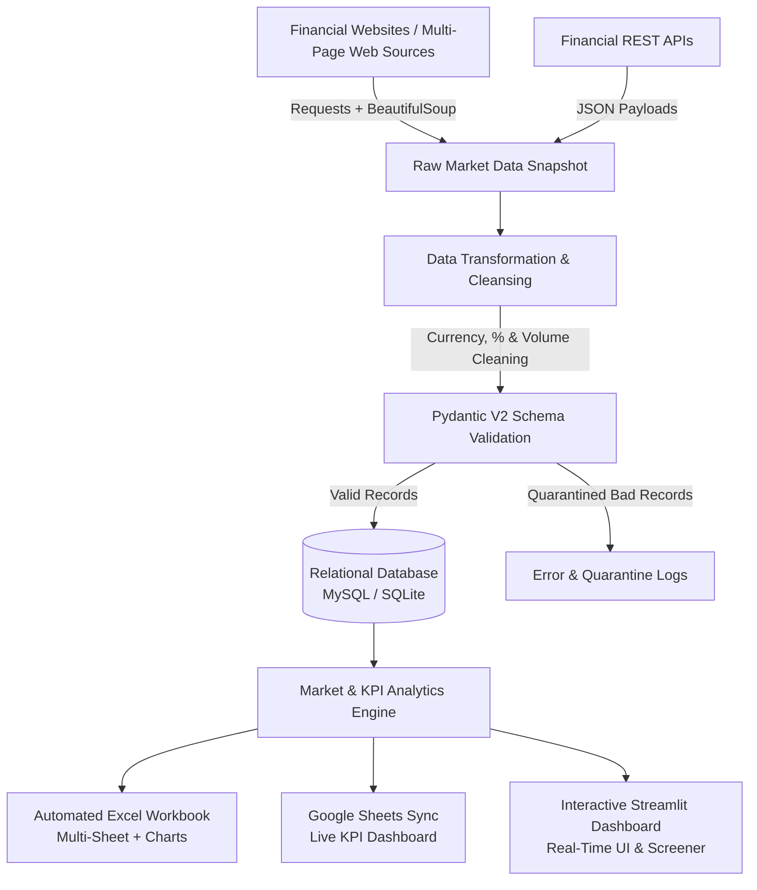

# 📈 Automated Market Data Scraper & Analytics Pipeline

> A robust, end-to-end Python data engineering and financial analytics pipeline that extracts multi-page market data, cleans and validates schema constraints, stores records in a normalized relational database (MySQL with SQLite fallback), computes financial KPIs, and delivers automated reports across Excel, Google Sheets, and an interactive Streamlit dashboard.

---

## 🏗️ Architecture & Data Workflow



---

## 🚀 Key Features

1. **Multi-Page Web Scraping with Resilient Retries**:
   - Built with `requests` and `BeautifulSoup4`.
   - Features `urllib3` exponential backoff retry strategies (status codes `429`, `500`, `502`, `503`, `504`).
   - Handles multi-page pagination (`?page=1..N`) and Next-page link discovery.
   - Built-in deterministic fallback and simulated HTML engine for 100% reliable offline testing and interviews.

2. **REST API Financial Ingestion**:
   - Demonstrates dual ingestion capabilities (Web Scraping + REST APIs).
   - Ingests structured JSON market quotes with authentication header handling and error recovery.

3. **Production Data Cleaning & Transformation**:
   - Cleans localized currency strings (`₹1,450.50`, `$2,980.00` → `1450.50`).
   - Normalizes signed percentages (`+1.25%`, `-0.45%` → `1.25`, `-0.45`).
   - Converts financial scale units (`4.2M` → `4,200,000`, `₹5,23,450 Cr` → `523450.0`).

4. **Pydantic V2 Schema Validation**:
   - Strictly enforces entity integrity for `CompanyModel`, `StockPriceModel`, and `FundamentalModel`.
   - Prevents negative prices, empty symbols, or invalid date formats from corrupting the database.
   - Bad records are automatically quarantined with diagnostic logging.

5. **Normalized Relational Database Layer**:
   - Fully normalized 3NF relational schema:
     - `companies`: Master entity (`symbol`, `company_name`, `sector`, `industry`).
     - `stock_prices`: Daily time-series prices (`price_date`, `open`, `high`, `low`, `close`, `volume`, `change_percent`).
     - `fundamentals`: Corporate financial ratios (`market_cap`, `pe_ratio`, `eps`, `revenue`, `profit`, `debt`).
     - `scraper_runs`: Full ETL pipeline execution logs and telemetry tracking.
   - **Dual Engine Support**: Natively connects to **MySQL** in production and seamlessly falls back to **SQLite** (`data/market_analytics.db`) for zero-configuration local runs.

6. **Automated Multi-Sheet Excel Reporting (`openpyxl`)**:
   - **Sheet 1 — Market Data**: Styled table with currency formatting and dynamic conditional color formatting (Green for gainers, Red for losers).
   - **Sheet 2 — KPI Summary**: Executive metric cards and Top 5 Gainers/Losers.
   - **Sheet 3 — Sector Analysis**: Sector return averages with an embedded OpenPyXL bar chart.

7. **Google Sheets API Integration**:
   - Syncs executive KPIs and leaderboards directly to a Google Sheet via `gspread` and Google Service Account credentials.
   - Includes automatic simulation/dry-run logging when credentials are not configured.

8. **Interactive Streamlit Web Dashboard**:
   - Visual KPI metric cards, sector distribution charts, and market breadth indicators.
   - Searchable and filterable stock screener with Sector and P/E ratio sliders.
   - "Run Pipeline Now" button to trigger the entire ETL pipeline directly from the UI with live progress indicators.

9. **Automated Scheduling**:
   - Windows Task Scheduler automation script (`scripts/schedule_windows.ps1`).
   - Linux Cron automation script (`scripts/schedule_cron.sh`).

---

## 📁 Repository Structure

```
automated-market-data-pipeline/
│
├── scraper/
│   ├── __init__.py
│   ├── stock_scraper.py          # Multi-page web scraper with retries
│   ├── fundamentals_scraper.py   # Scraper for corporate fundamentals & ratios
│   └── api_client.py             # REST API financial client
│
├── etl/
│   ├── __init__.py
│   ├── extract.py                # Extraction orchestrator & raw snapshots
│   ├── transform.py              # Cleaning, currency parsing & normalization
│   ├── validate.py               # Pydantic v2 schema & type validation
│   └── load.py                   # Relational upsert loader & telemetry logging
│
├── database/
│   ├── __init__.py
│   ├── schema.sql                # MySQL & SQLite relational DDL
│   └── db_connection.py          # Database connection manager & pool
│
├── analytics/
│   ├── __init__.py
│   ├── market_analysis.py        # Sector returns, market breadth, volatility
│   └── kpi_analysis.py           # Top gainers/losers, executive KPIs
│
├── reports/
│   ├── __init__.py
│   ├── excel_report.py           # OpenPyXL multi-sheet workbook generator
│   └── google_sheets.py          # Google Sheets API updater
│
├── config/
│   ├── __init__.py
│   └── config.py                 # Environment variables & configuration
│
├── scripts/
│   ├── schedule_windows.ps1      # Windows Task Scheduler automation
│   └── schedule_cron.sh          # Linux Cron automation
│
├── data/
│   ├── raw/                      # Raw JSON snapshots from scrapers
│   └── processed/                # Transformed & cleaned data exports
│
├── tests/
│   ├── __init__.py
│   └── test_pipeline.py          # Pytest unit & integration test suite
│
├── dashboard.py                  # Streamlit interactive web application
├── main.py                       # CLI pipeline orchestrator
├── requirements.txt              # Project dependencies
├── .env.example                  # Environment configuration template
├── .env                          # Local environment settings
└── README.md                     # Documentation
```

---

## ⚙️ Installation & Setup

### 1. Clone & Install Dependencies
```bash
# Clone the repository
git clone https://github.com/yourusername/automated-market-data-pipeline.git
cd automated-market-data-pipeline

# Install required Python packages
pip install -r requirements.txt
```

### 2. Configure Environment (`.env`)
Copy the template and configure your database and settings:
```bash
cp .env.example .env
```
*(Default settings use SQLite out-of-the-box. To use MySQL, set `DB_TYPE=mysql` and provide your MySQL credentials in `.env`).*

---

## 🏃 Execution Guide

### Run End-to-End Pipeline via CLI
```bash
python main.py
```

Options:
```bash
python main.py --pages 4 --export-excel --sync-sheets
python main.py --dry-run      # Test extraction and validation without database writes
```

### Launch Interactive Streamlit Dashboard
```bash
streamlit run dashboard.py
```

### Run Test Suite
```bash
pytest tests/test_pipeline.py -v
```

### Schedule Daily Automation
- **Windows (PowerShell)**:
  ```powershell
  powershell -ExecutionPolicy Bypass -File scripts\schedule_windows.ps1
  ```
- **Linux (Bash)**:
  ```bash
  chmod +x scripts/schedule_cron.sh
  ./scripts/schedule_cron.sh
  ```

---

## 📊 Sample Pipeline Output

```
================================================================
🚀 AUTOMATED MARKET DATA SCRAPER & ANALYTICS PIPELINE
================================================================
[INFO   ] [1/6] Extracting market data across 4 pages & REST API...
[INFO   ] [INFO] 20 raw stock records extracted.
[INFO   ] [2/6] Cleaning, normalizing, and casting data types...
[INFO   ] [3/6] Enforcing Pydantic v2 schema constraints...
[INFO   ] [INFO] Validation successful: 0 fatal schema violations.
[INFO   ] [4/6] Loading into SQLITE relational database...
[INFO   ] [INFO] 40 records loaded into database successfully.
[INFO   ] [5/6] Generating multi-sheet Excel KPI report...
[INFO   ] [INFO] Excel report generated: market_analytics_report_20260913_173000.xlsx
[INFO   ] [6/6] Synchronizing KPI dashboard to Google Sheets...
[INFO   ] [INFO] Google Sheets sync completed.
================================================================
📊 EXECUTIVE MARKET SUMMARY
================================================================
+----------------------+--------------------+
| KPI Metric           | Value              |
+======================+====================+
| Tracked Companies    | 20                 |
| Average Daily Return | +0.47%             |
| Total Market Cap     | ₹1,03,42,600.00 Cr |
| Market Breadth       | 2.33 (Bullish)     |
| Top Gainer           | ADANIENT (+2.37%)  |
| Top Loser            | WIPRO (-2.14%)     |
| Execution Duration   | 2.45 seconds       |
| Database Engine      | SQLITE             |
+----------------------+--------------------+
[INFO   ] ✅ Pipeline completed successfully in 2.45 seconds.
```

---

## 💼 Resume Description & Portfolio Highlights

**Project Title**: Automated Market Data Scraper & Analytics Pipeline  
**Technologies**: Python, Pandas, SQL, MySQL, SQLite, BeautifulSoup4, Requests, Pydantic V2, OpenPyXL, Google Sheets API, Streamlit, Pytest, Windows Task Scheduler / Cron

**Key Resume Points**:
- Engineered an automated Python-based ETL pipeline using Requests, BeautifulSoup, and REST APIs to extract structured market and fundamental data across multi-page sources with exponential backoff retries.
- Implemented robust data cleansing, currency normalization, and strict Pydantic V2 schema validation to eliminate nulls and prevent database corruption.
- Designed a normalized 3NF MySQL/SQLite relational database schema with indexed foreign keys and upsert capabilities for daily stock prices, company fundamentals, and pipeline execution logs.
- Built automated Excel workbooks with `openpyxl` featuring custom styles, conditional formatting, and embedded charts, alongside live Google Sheets synchronization.
- Developed an interactive Streamlit analytics dashboard with real-time stock screeners, sector breadth metrics, on-demand ETL execution, and telemetry tracking.
